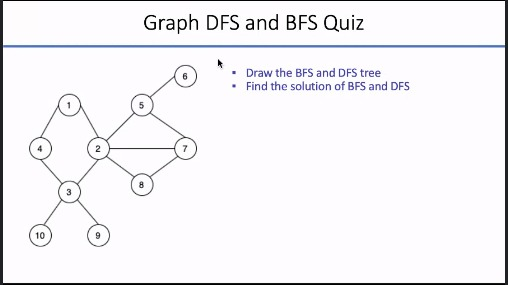

# BFS dan DFS

Contoh soal:

 
## Penjelasan BFS

**Line 1-11**: Grafik bergambar direpresentasikan menggunakan daftar adjacency. Cara mudah untuk melakukan ini di Python adalah dengan menggunakan struktur data kamus, di mana setiap simpul memiliki daftar tersimpan dari simpul yang berdekatan.

**Line 14**: variable visited adalah daftar yang digunakan untuk melacak node yang dikunjungi.

**Line 15**: variable queue adalah list yang digunakan untuk melacak node saat ini dalam antrian.

**Line 17-28**: memeriksa dan menambahkan node awal ke list yang dikunjungi. Kemudian, ketika queue mengandung elemen, queue terus mengeluarkan node dari queue, menambahkan node tetangga tersebut ke queue jika belum dikunjungi, dan menandainya sebagai visited. Ini berlanjut sampai queue kosong.

**Line 30**: fungsi bfs adalah list yang visited, graph dalam bentuk kamus, dan node awal 1.

## Penjelasan DFS

**Line 1-11**: Grafik bergambar diwakili menggunakan daftar adjacency - cara mudah untuk melakukannya dengan Python adalah dengan menggunakan struktur data kamus. Setiap simpul memiliki daftar node yang berdekatan yang disimpan.

**Line 14**: variable visited adalah set yang digunakan untuk melacak node yang dikunjungi.

**Line 16-21**: dfs mengikuti algoritme yang dijelaskan di atas: Ini pertama-tama memeriksa apakah node saat ini belum dikunjungi - jika ya, itu ditambahkan dalam set yang dikunjungi. Kemudian untuk setiap tetangga dari node saat ini, fungsi dfs dipanggil lagi. Kasus dasar dipanggil ketika semua node dikunjungi. Fungsi kemudian kembali.

**Line 23**: Fungsi dfs dipanggil dan dilewatkan set yang dikunjungi, grafik dalam bentuk kamus, dan A, yang merupakan simpul awal.

Source : github.com/kmayutrisna